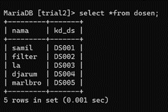
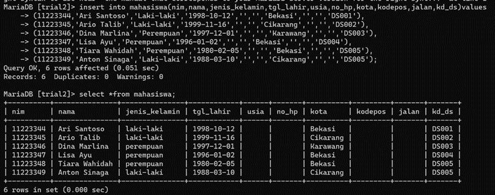
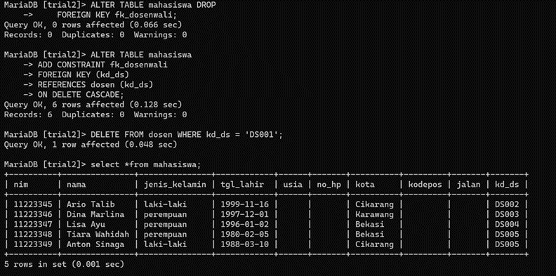
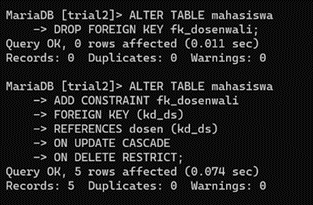
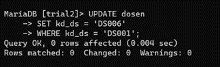
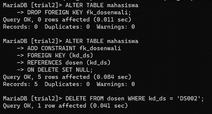
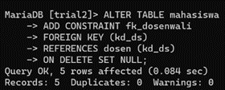
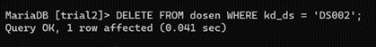

# PRAKTIKUM 3

# Daftar tugas yang di minta

- Lakukan penambahan data pada tabel mahasiswa dengan mengisi kd_ds yang belum ada pada data dosen. 
- Hapus satu record dat pada tabel dosen yang telah dirjuk pada tabel mahasiswa. 
- Ubah mode menjadi ON UPDATE CASCADE ON DELETE RESTRICT. 
- Lakukan perubahan data pada tabel dosen (kd_ds).
- Lakukan penghapusan data pada tabel dosen, 
-  Ubah mode menjadi ON UPDATE CASCADE ON DELETE SET NULL 
-  Lakukan penghapusan data pada tabel dosen.

# Berikut langkah langkah pembuatan yang di minta

- Langkah pertama adalah melakukan penambahan data pada tabel mahasiswa dengan mengisi kd_ds yang belum ada pada data dosen 

- Ini merupakan gambaran secara keseluran

- Langkah kedua yaitu mengajpsu satu record data pada tabel dosen yang telah di rujuk pada tabel mahasiswa

- Langkah ketiga yaitu mengubah modemenjadi ON UPDATE CASCADE ON DELETE RESTRICT

- Langkah ke empat Lakukan perubahan data pada tabel dosen (kd_ds)

- Langkah ke lima yaitu Lakukan penghapusan data pada tabel dosen

- Langkah ke enam Ubah mode menjadi ON UPDATE CASCADE ON DELETE SET NULL 

- Langkah ke tujuh Lakukan penghapusan data pada tabel dosen

# PERBEDAAN RESCRICT DAN CASCADE

RESCRICT adalah jika kita menghapus atau merubah baris data dalam tabel A maka tidak akan diperbolehkan jika pada tabel B masih ditemukan relasi datanya. InnoDB dapat menolak perintah perubahan atau penghapusan tersebut.

CASCADE adalah jika kita menghapus atau merubah baris data dalam tabel A secara otomatis akan menghapus atau merubah baris yang sesuai dalam tabel B.

# KESIMPULAN 

RESCRIFT Merupakan perintah untuk menghapus dan juga merubah baris data di dalam tabel secara manual 

CASCADE merupakan perintah menghapus dan merubah baris data dengan menggunakan cara otomatis pada tabel yang ada
